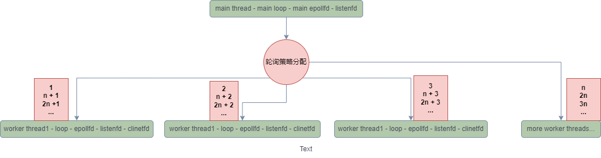
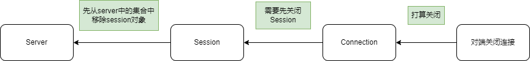
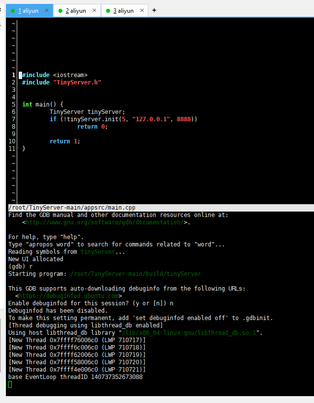
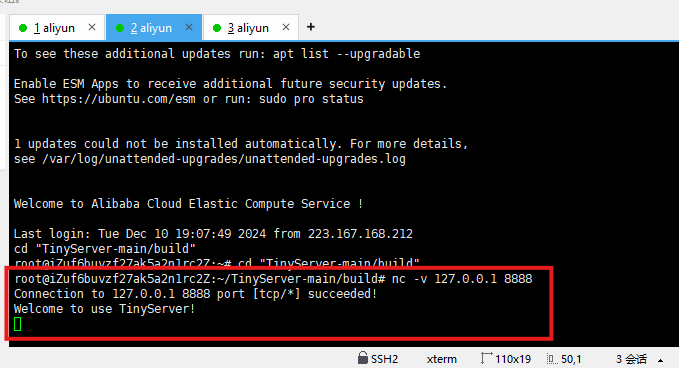
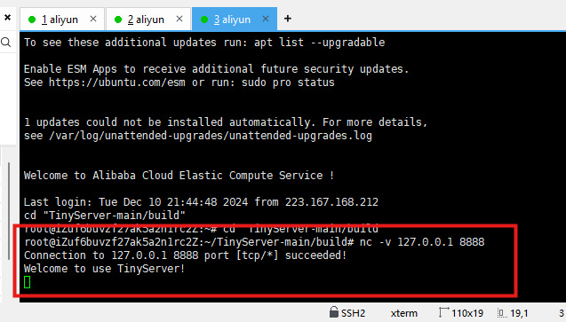
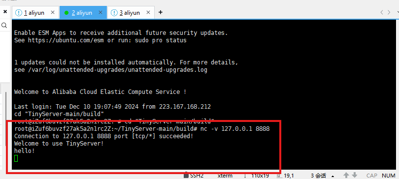
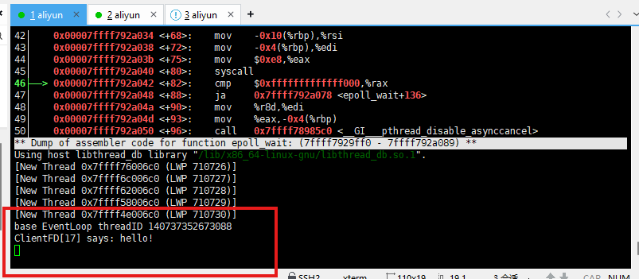
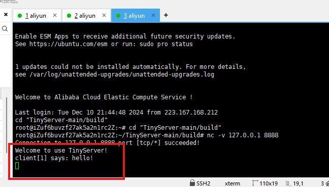

# Tiny Server

基于reactor架构的简易服务器。One Thread One Loop 模式。使用round-robin策略分配工作线程




## 环境配置

* linux 系统Linux 6.8.0-40-generic，推荐Ubuntu24.04 /centos7.0以上
* 安装Cmake3.0 以上, make4.3 , gcc 13.2
* 编译步骤
  1. 解压zip文件
  2. 打开到 CMakeLists.txt 所在路径
  3. 创建build 文件夹，并打开
  4. 运行`cmake ..`
  5. 执行`make -j 2`

## 模块介绍

1. 该项目主要有两部分组成，网络层和应用层
2. 应用层，包含TcpServer 类 和 Session 类
   1. TcpServer 类： 创建线程池，管理工作任务
   2. Session 类：管理每个连接，负责处理消息和解包
3. 网络层，包含Acceptor类，Buffer类，EventLoop类，IOOMultiplex 类（及派生类），TCPConnection 类，TCPServer类，ThreadPool类
   - Acceptor类 ：负责处理监听fd，接收到新连接，调用回调函数：TCPServer::onAccept
   - Buffer类：管理读/写缓冲区。为了避免半包/粘包的问题，使用'\n' 作为标志位
   - EventLoop类：reactor架构核心组件，进行事件循环检测和处理
   - IOOMultiplex 类（及派生类）：封装了常用了IO复用函数，select, poll, epoll
   - IEventDispatcher 类：抽象类，TCPConnection的父类，指定了四个基本功能：onRead，onWrite，onClose，enableReadWrite
   - TCPConnection 类: 管理复用函数上事件，采用的是水平模式，将onRead/onWrite/onClose在网络层处理完后，利用回调函数返回到用户层处理
   - TCPServer类：管理主loop，负责任务分发的工作
   - ThreadPool类：管理线程，每个线程绑定一个loop，负责分配策略。

## 技术亮点

- 项目中使用了回调机制来实现不同层之间的交互

- 执行EvenLoop 中的otherTask时，使用的时任务队列的机制。在处理任务时，先将所有任务拷贝到临时队列，避免在执行任务时阻塞太多时间，同时降低了锁的粒度以达到提高性能的目的

  ```
  void EventLoop::doOtherTasks() {
  	std::vector<CustomTask> tasks;
  
  	{
  		std::lock_guard<std::mutex> scopedLock(m_mutexTasks);
  		tasks.swap(m_customTask);
  	}
  
  	for (auto& task : tasks) {
  		task();
  	}
  }
  ```

- 利用**epoll_event** 结构体的 **data** 字段的特性（union data 中的void* ptr），将TcpConnection对象与事件事件，当处理事件可以快速拿到TcpConnection对象，以提高性能

- 使用C++ 11的函数式编程，来实现回调机制

  - 通过使用using 和 std::function来管理回调函数

  ```
  using ReadCallback = std::function<void(Buffer&)>;
  using WriteCallback = std::function<void()>;
  using CloseCallback = std::function<void(const std::shared_ptr<TCPConnection>&)>;
  ```

  - 使用std::bind 进行回调函数初始化

  ```
  m_tcpServer.setConnectedCallback(std::bind(&TinyServer::onConnected, this, std::placeholders::_1));
  ```

- 使用C++11 的模板类std::enable_shared_from_this管理对象周期 ，自身的回调函数可以将自身传向用户层，避免使用this裸指针导致资源重复释放导致内存错误，统一指针对象管理方式。同时也增加了代码的易读性。

  ```
  class TCPConnection : public IEventDispatcher, public std::enable_shared_from_this<TCPConnection> {}
  
  void TCPConnection::onClose() {
  	unregisterAllEvents();
  	m_closeCallback(shared_from_this());
  }
  ```

- 在关闭session时，使用了**延迟关闭**的机制，将要销毁的tcp connection对象存入专门等待销毁的pending容器中，等下个连接产生再销毁它。避免自己回调函数调用自身对象时，调用堆栈还没结束，自身对象就已经被销毁的现象出现，导致内存错误问题。

  

## 运行截图

- server 启动



- 用户1连接

  

- 用户2连接

  

- 用户1发送消息

  

- server接收到消息

  

- 用户2接收到消息

  
